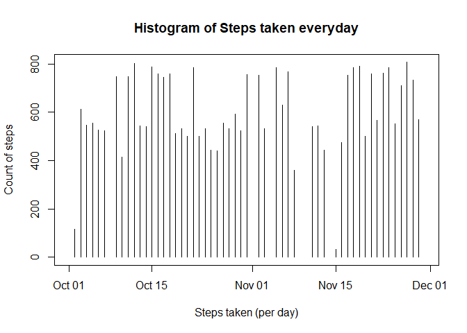
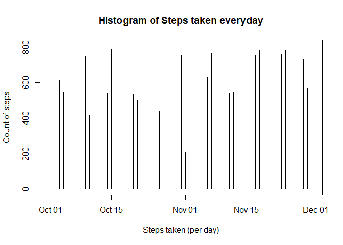
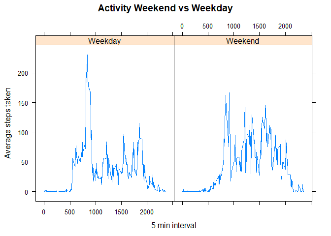

Loading Data
------------

``` r
activity_data <- read.csv("activity.csv",sep = ",")
activity_data$date <- as.Date(activity_data$date)

#Lets check data frame data types
str(activity_data)
```

    ## 'data.frame':    17568 obs. of  3 variables:
    ##  $ steps   : int  NA NA NA NA NA NA NA NA NA NA ...
    ##  $ date    : Date, format: "2012-10-01" "2012-10-01" ...
    ##  $ interval: int  0 5 10 15 20 25 30 35 40 45 ...

``` r
#checking dimensions of data frames
dim(activity_data)
```

    ## [1] 17568     3

Histogram of Steps
------------------

``` r
plot(activity_data$date,activity_data$steps, type = 'h',xlab = "Steps taken (per day)", ylab = "Count of steps", main = "Histogram of Steps taken everyday")
```



Mean and Median
---------------

``` r
#Mean number of steps taken each day
aggregate(steps ~ date, activity_data,mean)
```

    ##          date      steps
    ## 1  2012-10-02  0.4375000
    ## 2  2012-10-03 39.4166667
    ## 3  2012-10-04 42.0694444
    ## 4  2012-10-05 46.1597222
    ## 5  2012-10-06 53.5416667
    ## 6  2012-10-07 38.2465278
    ## 7  2012-10-09 44.4826389
    ## 8  2012-10-10 34.3750000
    ## 9  2012-10-11 35.7777778
    ## 10 2012-10-12 60.3541667
    ## 11 2012-10-13 43.1458333
    ## 12 2012-10-14 52.4236111
    ## 13 2012-10-15 35.2048611
    ## 14 2012-10-16 52.3750000
    ## 15 2012-10-17 46.7083333
    ## 16 2012-10-18 34.9166667
    ## 17 2012-10-19 41.0729167
    ## 18 2012-10-20 36.0937500
    ## 19 2012-10-21 30.6284722
    ## 20 2012-10-22 46.7361111
    ## 21 2012-10-23 30.9652778
    ## 22 2012-10-24 29.0104167
    ## 23 2012-10-25  8.6527778
    ## 24 2012-10-26 23.5347222
    ## 25 2012-10-27 35.1354167
    ## 26 2012-10-28 39.7847222
    ## 27 2012-10-29 17.4236111
    ## 28 2012-10-30 34.0937500
    ## 29 2012-10-31 53.5208333
    ## 30 2012-11-02 36.8055556
    ## 31 2012-11-03 36.7048611
    ## 32 2012-11-05 36.2465278
    ## 33 2012-11-06 28.9375000
    ## 34 2012-11-07 44.7326389
    ## 35 2012-11-08 11.1770833
    ## 36 2012-11-11 43.7777778
    ## 37 2012-11-12 37.3784722
    ## 38 2012-11-13 25.4722222
    ## 39 2012-11-15  0.1423611
    ## 40 2012-11-16 18.8923611
    ## 41 2012-11-17 49.7881944
    ## 42 2012-11-18 52.4652778
    ## 43 2012-11-19 30.6979167
    ## 44 2012-11-20 15.5277778
    ## 45 2012-11-21 44.3993056
    ## 46 2012-11-22 70.9270833
    ## 47 2012-11-23 73.5902778
    ## 48 2012-11-24 50.2708333
    ## 49 2012-11-25 41.0902778
    ## 50 2012-11-26 38.7569444
    ## 51 2012-11-27 47.3819444
    ## 52 2012-11-28 35.3576389
    ## 53 2012-11-29 24.4687500

``` r
#tapply(activity_data$steps, activity_data$date, mean, na.rm = TRUE)

#Median number of steps taken each day 
aggregate(steps ~ date, activity_data,median)
```

    ##          date steps
    ## 1  2012-10-02     0
    ## 2  2012-10-03     0
    ## 3  2012-10-04     0
    ## 4  2012-10-05     0
    ## 5  2012-10-06     0
    ## 6  2012-10-07     0
    ## 7  2012-10-09     0
    ## 8  2012-10-10     0
    ## 9  2012-10-11     0
    ## 10 2012-10-12     0
    ## 11 2012-10-13     0
    ## 12 2012-10-14     0
    ## 13 2012-10-15     0
    ## 14 2012-10-16     0
    ## 15 2012-10-17     0
    ## 16 2012-10-18     0
    ## 17 2012-10-19     0
    ## 18 2012-10-20     0
    ## 19 2012-10-21     0
    ## 20 2012-10-22     0
    ## 21 2012-10-23     0
    ## 22 2012-10-24     0
    ## 23 2012-10-25     0
    ## 24 2012-10-26     0
    ## 25 2012-10-27     0
    ## 26 2012-10-28     0
    ## 27 2012-10-29     0
    ## 28 2012-10-30     0
    ## 29 2012-10-31     0
    ## 30 2012-11-02     0
    ## 31 2012-11-03     0
    ## 32 2012-11-05     0
    ## 33 2012-11-06     0
    ## 34 2012-11-07     0
    ## 35 2012-11-08     0
    ## 36 2012-11-11     0
    ## 37 2012-11-12     0
    ## 38 2012-11-13     0
    ## 39 2012-11-15     0
    ## 40 2012-11-16     0
    ## 41 2012-11-17     0
    ## 42 2012-11-18     0
    ## 43 2012-11-19     0
    ## 44 2012-11-20     0
    ## 45 2012-11-21     0
    ## 46 2012-11-22     0
    ## 47 2012-11-23     0
    ## 48 2012-11-24     0
    ## 49 2012-11-25     0
    ## 50 2012-11-26     0
    ## 51 2012-11-27     0
    ## 52 2012-11-28     0
    ## 53 2012-11-29     0

``` r
#tapply(activity_data$steps, activity_data$date, median, na.rm = TRUE)
```

Time series plot of average step taken throughout day
-----------------------------------------------------

``` r
avg_steps <- aggregate(steps ~interval, activity_data,mean)
plot(avg_steps$interval,avg_steps$steps,type ='l',xlab = "Date", ylab= "Average steps taken", main = "Time series plot")
```


``` r
#Which 5-minute interval, on average across all the days in the dataset, contains the maximum number of steps?
avg_steps$interval[avg_steps$steps==max(avg_steps$steps)]
```

    ## [1] 835

Histogram of Steps (NAs imputed)
--------------------------------

``` r
#Calculating total NA's

colSums(is.na(activity_data))
```

    ##    steps     date interval 
    ##     2304        0        0

``` r
for (i in unique(activity_data$interval)){
        activity_data$steps[activity_data$interval==i] <- ifelse(is.na(activity_data$steps[activity_data$interval==i]),mean(activity_data$steps[activity_data$interval==i],na.rm = T),activity_data$steps[activity_data$interval==i])
}

#New Histogram plot after NAs are removed
plot(activity_data$date,activity_data$steps, type = 'h',xlab = "Steps taken (per day)", ylab = "Count of steps", main = "Histogram of Steps taken everyday")
```



Panel plot for weekday and weekend
----------------------------------

``` r
library(dplyr)
```

    ## 
    ## Attaching package: 'dplyr'

    ## The following objects are masked from 'package:stats':
    ## 
    ##     filter, lag

    ## The following objects are masked from 'package:base':
    ## 
    ##     intersect, setdiff, setequal, union

``` r
library(lattice)
weekdays_list <- c('Monday','Tuesday','Wednesday','Thursday','Friday')
activity_data_weekday_test <- mutate(activity_data,WTest = ifelse(weekdays(activity_data$date) %in% weekdays_list,"Weekday","Weekend"))

activity_data_weekday_test <- aggregate(steps ~ interval + WTest,activity_data_weekday_test,mean,na.rm=T)
#Panel plot comparing the average number of steps taken per 5-minute interval across weekdays and weekends
xyplot(steps ~ interval | WTest, data = activity_data_weekday_test, main = "Activity Weekend vs Weekday", xlab = "5 min interval", ylab = "Average steps taken",type = "l")
```


